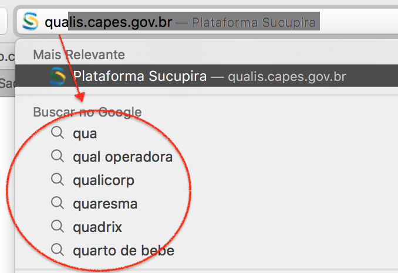
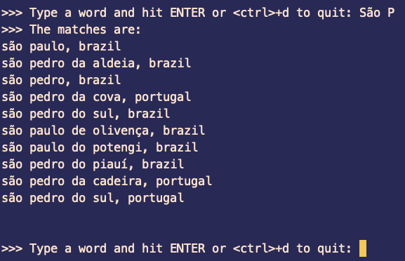
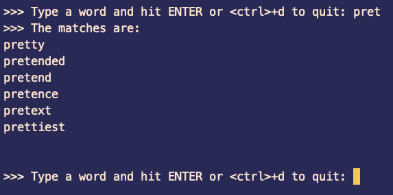

# Programming Assignment: Autocomplete System

### Table of Contents
1. [Introdução](#introduction)
2. [O problema](#the-problem)
3. [Interface](#interface)
4. [Implementação](#implementation)
5. [Saída](#output)

# Introduction

Autocomplete é uma ferramenta comum em aplicações modernas. Enquanto o usuário digita, o programa prevê o quê o usuário está tentando digitar (usualmente uma palavra ou frase).

Segue abaixo um exemplo típico do Autocomplete:




O Autocomplete é mais efetivo quando quando existe um número limitado de possibilidades mais prováveis. Por exemplo, a _Internet Movie Database_ usa autocomplete para mostrar os nomes dos possíveis filmes enquanto o usuário digita; _engines_ de busca usam a técnica para mostrar sugestões de busca; celulares usam a técnica para acelerar a digitação de textos.

Nestes exemplos, as aplicações preveem qual a chance estar sendo digitada uma dada sentença e apresenta ao usuário uma lista das sentenças mais prováveis, na ordem decrescente de "peso". Os pesos de um conjunto de sentenças são determinados por vários fatores, tais como o volume de vendas de um determinado filme, a frequencia de busca de cada sentença no Google ou o histórico de palavras digitadas pelo usuário do celular. 

A performance de um sistema de autocomplete é uma característica critica em muitos sistemas. Por exemplo, considere uma _engine_ de busca que executa uma aplicação de autocomplete em um servidor. De acordo com alguns estudos, a aplicação tem apenas algo como 50ms para retornar uma lista de sugestões de forma que essa lista seja útil para o usuário. Em adição, a aplicação tem que executar esse processamento para cada tecla digitada **para cada usuário do sistema**.

# O problema

Neste trablho você terá que projetar e implementar um **sistema de autocomplete**.

Su programa deve inicialmente, ler uma base de dados com uma lista com _n entradas_. Neste trabalho, uma entrada na base de dados é um par `sentença + peso`, onde a `senteça` é uma string que pode ser um possível resultado de uma operação de autocomplete, e o peso é um inteiro que representa a relevancia daquela sentença na base de dados: quanto maior o valor do peso, maior a relevancia da sentença relacionada com ele. Abaixo é mostrado um exemplo de uma base de dados de entrada, chamada `wiktionary.txt`, que representa a frequencia que algumas palavras aparecem em textos em Inglês.

```
10000
   5627187200	the
   3395006400	of
   2994418400	and
   2595609600	to
   1742063600	in
   1176479700	i
   1107331800	that
   1007824500	was
    879975500	his
                ...
       392323	calves
```

Note que a palavra **"the"** é a mais frequente neste caso, uma vez que ela tem o maior valor de peso: 5627187200. Claro que esse dicionário não é completo, uma vez que ele contém apenas 10 mil palavras.

Depois de ler e processar a base de dados de entrada, o seu sistema de autocomplete deve perguntar ao usuário por um fragmento de palavra ou senteça (ou mesmo uma palavra/sentença inteira). Depois disso, o programa deve _encontrar e retornar todas as possiveis sentenças na base de dados que iniciam com o fragmento/palavra/sentença_ que foi fornecido, mostrando o resultado na ordem decrescente de peso. No caso em que o termo não foi encontrado, o programa deve imprimir a mensagem _"no match found"_.

Após isso o programa deve perguntar novamente por um novo prefixo de palavra ou sentença até que o usuário envie EOF(`<Ctr>+D`) para terminar.

# Interface

No exemplo abaixo, o programa tem nome de `autocomplete`, ele deve ler os argumentos da linha de comando como segue:

```
% ./autocomplete
Usage: autocomplete <databse_file>
  Where <database_file> is the ascii file that contains the query terms and weights.
```

O `<database_file>` é um arquivo de texto que contem `n` linhas, cada uma contendo uma **sentença** e seu valor correspondente de **peso**.

Dois arquivos de dadatabase podem ser encontrados no diretório [data](data).

# Implementação

Fique à vontade para modelar o programa como você achar que deve. No entanto, faça ao menos 3 classes:

1. Uma classe deve ficar à cargo da Interface com o usuário, especialmente ler a entrada e escrever as possíveis saídas.
2. Uma classe deve ficar à cargo de processar e guardar as informações do banco de dados.
3. Uma classe deve ficar à cargo de processar e guardar o resultado de uma requisição do usuário, ou seja, ela deve conter o conjunto de palavras que resultam da requisição, bem como outras informações que voce ache relevante.

Como, neste caso, estamos interessados também na eficiencia da solução, os passos recomendados para resolver o problema são:

1. Leia o arquivo da base de dados e ordene pela _string_ correspondente à sentença;
2. Leia a entrada do usuário. Caso o usuário entre EOF (`<Ctrl>+D`) finalize, caso contrário, vá para o passo seguinte;
3. Execute uma `busca binária` para encontrar criar um conjunto com todas as entradas da base que iniciam com o prefixo buscado, para tanto você pode usar os algoritmos da stl: [`lower_bound`](http://en.cppreference.com/w/cpp/algorithm/lower_bound) e [`upper_bound`](http://en.cppreference.com/w/cpp/algorithm/upper_bound);
4. Ordene o conjunto criado pelo peso
5. Apresente o resultado para o usuário e volte ao passo 2.

Outro ponto à observar é o uso de referencias ao invés de cópias quando tratamos tipos não básicos. C++ é uma linguagem muito eficiente, mas que pode perder desempenho a medida que começamos a usar cópias ao invés de referencias, especialmente quando os dados processados são escalares (vetores, matrizes, etc). Neste trabalho, quando for processar objetos que são compostos por arrays, seja em parâmetros dos métodos/funções ou nos retornos destes, tente usar referencias ao invés de cópias.

# Saída

Seguem algumas saídas, cada uma com base em uma base de dados diferente. O primeiro exemplo executa usando a base  `cities.txt`. O usuário entra com __"São P"__.



Neste segundo exemplo, a base de dados é `wiktionary.txt` e a string buscada foi __"pret"__.



Note que o programa não deve ser **case sensitive**. Ou seja, não deve fazer diferença se o usuário digita "São P", "são p", "SÃO P",  ou qualquer variação de maiúscula ou minúscula. A entrada do usuário deve ser convertida para um case qualquer (todas maiúsculas ou todas minúsculas), para facilitar a operação de busca na base de dados.

# Autorship

The description of this programming assignment was taken from [Computer Sciecne at Pricenton University](http://introcs.cs.princeton.edu/java/assignments/autocomplete.html).

**Adaptation: Selan R. Santos, [selan@dimap.ufrn.br](mailto:selan@dimap.ufrn.br)**

**Translation to PT-Br and Adaptation: Julio Melo, [julio.melo@imd.ufrn.br](mailto:julio.melo@imd.ufrn.br)**

&copy; DIMAp/UFRN 2021.
&copy; IMD/UFRN 2021.
